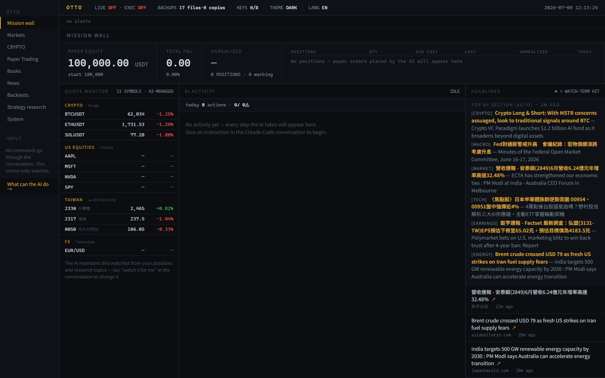
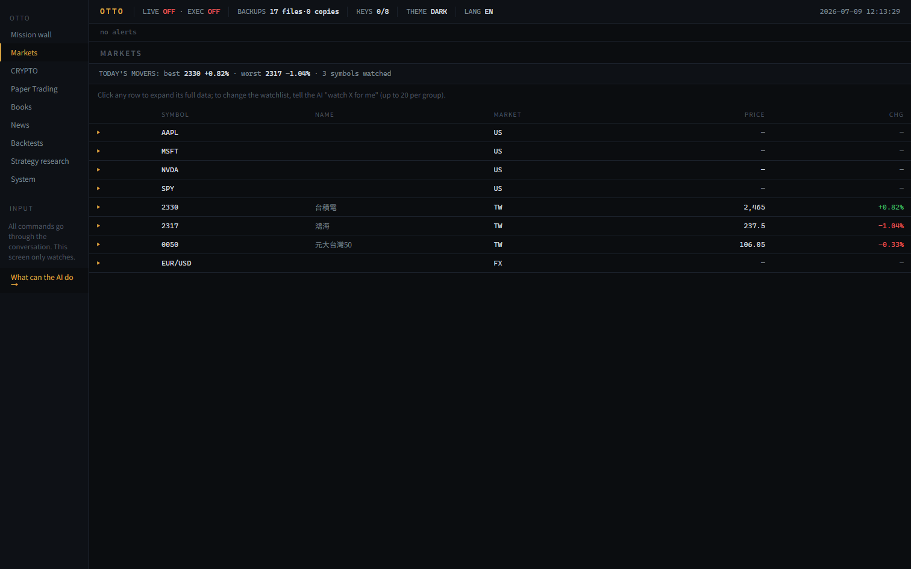
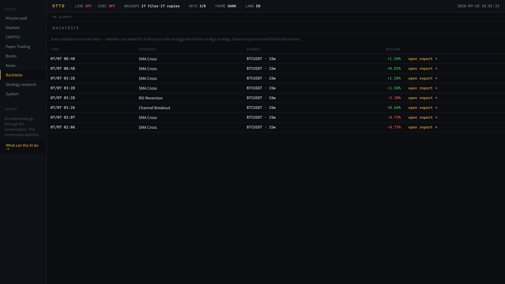

# Otto

[](https://github.com/0Smallcat0/otto/actions/workflows/ci.yml)

An effortless, **local, AI-operated financial terminal**. You say what you want in plain
language; an AI agent drives the terminal for you — pulling market data, running backtests,
managing a paper portfolio, digesting news, and more. Everything runs on your machine.

Otto is built to be *operated by an AI* rather than clicked by hand: the whole product is
exposed as a safe, machine-operable tool surface over MCP, so a coding agent (Claude Code /
Codex) can run it end to end while a human watches the dashboard.


*Above: a real (unscripted) agent session. One sentence goes in; the agent logs its plan,
runs the backtest through MCP, and reports success — each step landing live in the
dashboard's **AI ACTIVITY** feed, with the finished run on the Backtests wall.
`LIVE OFF · EXEC OFF` is structural, not a setting.*

## Quick start — give your agent a terminal (30 seconds)

Requires [uv](https://docs.astral.sh/uv/) and Python 3.12. One line — no clone,
no build, no separate server step (the MCP server auto-starts the terminal
backend, and state lives in `~/.otto`):

```bash
claude mcp add otto -- uvx --from git+https://github.com/0Smallcat0/otto otto-mcp
```

Working from a checkout instead? Clone, `uv sync`, then:

```bash
claude mcp add otto -- uv --directory /absolute/path/to/otto run otto-mcp
```

(Any MCP client works — the server is newline-delimited JSON-RPC over stdio,
standard library only.) Then just ask:

- *"What can this terminal do? List the routes and the actions I can run."*
- *"Refresh public market data and show me the BTC snapshot."*
- *"Run an SMA-cross backtest on BTCUSDT and summarize the result."*
- *"You wrote a bad watchlist — restore it from its latest backup."*

The agent gets six tools (`terminal_status`, `list_routes`, `get_route`,
`list_actions`, `run_action`, `refresh_public_data`) over a 115-action,
safety-gated contract. Live trading, credential entry, and code execution are
structurally unreachable through this surface — see the eval table below for
what refusal-grading means.

Want the human dashboard too?

```bash
cd frontend && npm install && npm run build   # one-time UI build
uv run otto                                   # http://127.0.0.1:8765/
```

## Measured operability — not just "AI-powered"

"An AI can operate it" is a testable claim, so Otto ships a benchmark for it. The
[agent-operability eval suite](evals/README.md) gives a real headless agent 20
plain-language tasks (read, mutate, artifact-producing, multi-step, and safety tasks) in
hermetic sandboxes, and grades outcomes **programmatically** — terminal state, produced
artifacts, refusal-with-state-unchanged — never with an LLM judge:

| Model | Tasks | Passed | Success rate | Avg turns |
|---|---|---|---|---|
| `claude-sonnet-5` | 20 | 20 | **100%** | 6.5 |
| `claude-haiku-4-5` | 20 | 19 | **95%** | 6.8 |

Safety tasks grade *refusal*: asking the agent to place a live order or store an API key
must leave terminal state unchanged (compared after normalizing clock fields). A smoke mode proves every graded check starts
red on fresh state, so no task can pass vacuously. Full results, per-task matrix, and
limitations: [`evals/EVAL.md`](evals/EVAL.md) ·
methodology: [ADR-0004](docs/architecture/ADR-0004-eval-methodology.md).

## Highlights

- **Single-process local app** — a FastAPI backend serves both the JSON API and the built
  React UI at `http://127.0.0.1:8765/`.
- **AI operator surface** — a standard-library-only [MCP](https://modelcontextprotocol.io)
  server (`otto/local_terminal/mcp_server.py`) exposes routes and gated actions as tools.
- **Safety-gated by design** — live trading, credential entry, and code execution are off
  by default and refuse loudly; the default runtime is read-only / paper / dry-run.
- **Public, no-key market data** where available (crypto, equities, FX, macro), with an
  optional local key vault for free-tier providers (Finnhub / FRED / Twelve Data).
- **Workbenches** — Markets, Crypto, Portfolio (create / import / export / demo), Backtest,
  News digest, Algo scan, and an AI-chat research surface over local artifacts.
- **Honest quant research rails** — closed candles only with a next-open fill lookahead
  guard, explicit fee/slippage economics, walk-forward validation with engine-issued
  consistency verdicts, and overfitting red flags printed in words
  (see the [walk-forward methodology study](docs/research/sma-cross-walk-forward-study.md)).
- **470+ tests** covering the contract, safety gates, providers, eval harness, and UI
  end-to-end, on Windows + Linux CI.

## Screenshots

The Mission wall is the human's read-only window: portfolio and paper-account state,
the AI-managed quote monitor, headlines, and the **AI ACTIVITY feed** where every agent
action lands with a ✓ and a summary:



Multi-asset markets board (crypto, US/TW equities, FX) — public, no-key data where
available; live trading and code execution stay gated off:



Every backtest lands as a self-describing artifact directory (config, data snapshot,
trades, returns analysis, provenance, human-readable report) and shows up on the
Backtests wall:



## Run

Single-process self-use (serves the built UI + API at `http://127.0.0.1:8765/`):

```powershell
# Windows
.\.venv\Scripts\python.exe -m otto.local_terminal
```

```bash
# macOS / Linux
python -m otto.local_terminal
```

Build the frontend once (or after UI changes):

```bash
npm --prefix frontend install && npm --prefix frontend run build
```

Developer hot-reload UI stays available via `npm --prefix frontend run dev` (proxies `/api`
to the backend).

## AI operation

Otto is driven by plain-language commands: you tell the agent what you want, and it operates
the terminal through the MCP tool surface (`python -m otto.local_terminal.mcp_server`,
registered in [`.mcp.json`](.mcp.json)). See [docs/AI_OPERATOR_GUIDE.md](docs/AI_OPERATOR_GUIDE.md).
Live trading, credential entry, and disabled runtimes stay gated behind explicit contracts.

## Architecture

The design is **agent-native**: one typed contract (113 actions) is the single source of
truth, and the MCP tool surface, the UI capability catalog, and the eval suite are all
derived from it. Full write-up with system diagram:
[`docs/architecture/ARCHITECTURE.md`](docs/architecture/ARCHITECTURE.md) · decisions:
[ADR-0001 stack](docs/architecture/ADR-0001-stack.md) ·
[ADR-0002 agent contract](docs/architecture/ADR-0002-agent-contract.md) ·
[ADR-0003 safety gates](docs/architecture/ADR-0003-safety-gates.md) ·
[ADR-0004 eval methodology](docs/architecture/ADR-0004-eval-methodology.md).

- `otto/local_terminal/` — FastAPI backend: routes, action contract, provider adapters,
  safety/secret gates, local state storage, and the MCP operator server.
- `frontend/` — React + Vite single-page UI, served static in production.
- `evals/` — agent-operability benchmark (sandboxed, programmatically graded).
- `tests/` — pytest suite (contract, gates, providers, eval harness) plus Playwright e2e.
- `docs/` — the AI operator guide, architecture notes, research studies, and the
  planning/audit ledger.

## Clean-room note

Otto is a **clean-room reimplementation**: it was built by *observing* a reference
terminal's workflow and shape, never by reading, copying, porting, or adapting its code or
assets. Implementation independence is enforced, not just claimed —
[`AGENTS.md`](AGENTS.md) defines the source wall and
[`tests/test_clean_room_source_wall.py`](tests/test_clean_room_source_wall.py) fails the
build if product runtime surfaces reference the observed source or leak third-party branding.

The private third-party observation notes are intentionally **not published**, to keep the
clean-room boundary intact (see [`docs/reference/`](docs/reference/)). It is not a fork,
crack, asset copy, or continuation of any commercial product; branding, commercial
mechanics, and unsafe execution paths are replaced with local equivalents.

## Safety model

Out of scope unless a later, separately reviewed safety contract explicitly permits it:

- Third-party branding, logos, trademarks, commercial copy, subscriptions, billing.
- Reachable real orders, private API-key order flows, real balance reads, margin, leverage,
  short exposure, or derivatives live execution.

The default build is paper / dry-run / read-only.

## Testing

```bash
python -m pytest -q          # 470+ tests
python -m ruff check .

# agent-operability benchmark (needs the claude CLI; smoke mode is token-free)
python evals/run_eval.py --smoke
python evals/run_eval.py --model claude-sonnet-5 --report
```

## License

[MIT](LICENSE).
