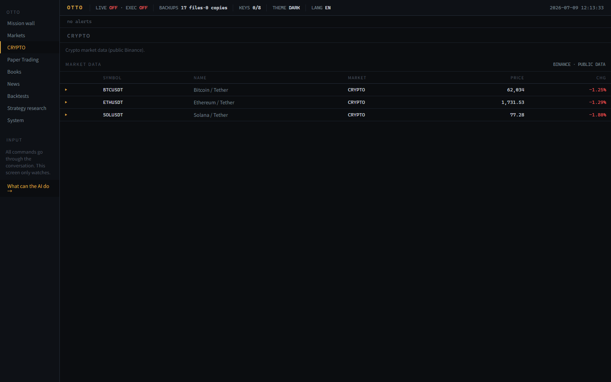

# Otto

An effortless, **local, AI-operated financial terminal**. You say what you want in plain
language; an AI agent drives the terminal for you — pulling market data, running backtests,
managing a paper portfolio, digesting news, and more. Everything runs on your machine.

Otto is built to be *operated by an AI* rather than clicked by hand: the whole product is
exposed as a safe, machine-operable tool surface over MCP, so a coding agent (Claude Code /
Codex) can run it end to end while a human watches the dashboard.


## Highlights

- **Single-process local app** — a FastAPI backend serves both the JSON API and the built
  React UI at `http://127.0.0.1:8765/`.
- **AI operator surface** — a standard-library-only [MCP](https://modelcontextprotocol.io)
  server (`src/local_terminal/mcp_server.py`) exposes routes and gated actions as tools.
- **Safety-gated by design** — live trading, credential entry, and code execution are off
  by default and refuse loudly; the default runtime is read-only / paper / dry-run.
- **Public, no-key market data** where available (crypto, equities, FX, macro), with an
  optional local key vault for free-tier providers (Finnhub / FRED / Twelve Data).
- **Workbenches** — Markets, Crypto, Portfolio (create / import / export / demo), Backtest,
  News digest, Algo scan, and an AI-chat research surface over local artifacts.
- **~460 tests** covering the contract, safety gates, providers, and UI end-to-end.

## Screenshots

Multi-asset markets board (crypto, US/TW equities, FX) and the live crypto workbench —
public, no-key data where available; live trading and code execution stay gated off:

| Markets | Crypto |
| --- | --- |
|  |  |

## Run

Single-process self-use (serves the built UI + API at `http://127.0.0.1:8765/`):

```powershell
# Windows
.\.venv\Scripts\python.exe -m src.local_terminal
```

```bash
# macOS / Linux
python -m src.local_terminal
```

Build the frontend once (or after UI changes):

```bash
npm --prefix frontend install && npm --prefix frontend run build
```

Developer hot-reload UI stays available via `npm --prefix frontend run dev` (proxies `/api`
to the backend).

## AI operation

Otto is driven by plain-language commands: you tell the agent what you want, and it operates
the terminal through the MCP tool surface (`python -m src.local_terminal.mcp_server`,
registered in [`.mcp.json`](.mcp.json)). See [docs/AI_OPERATOR_GUIDE.md](docs/AI_OPERATOR_GUIDE.md).
Live trading, credential entry, and disabled runtimes stay gated behind explicit contracts.

## Architecture

- `src/local_terminal/` — FastAPI backend: routes, action contract, provider adapters,
  safety/secret gates, local state storage, and the MCP operator server.
- `frontend/` — React + Vite single-page UI, served static in production.
- `tests/` — pytest suite (contract, gates, providers) plus Playwright e2e.
- `docs/` — the AI operator guide, architecture notes, and the planning/audit ledger.

## Clean-room note

Otto is a **clean-room reimplementation**: it was built by *observing* a reference
terminal's workflow and shape, never by reading, copying, porting, or adapting its code or
assets. Implementation independence is enforced, not just claimed —
[`AGENTS.md`](AGENTS.md) defines the source wall and
[`tests/test_clean_room_source_wall.py`](tests/test_clean_room_source_wall.py) fails the
build if product runtime surfaces reference the observed source or leak third-party branding.

The private third-party observation notes are intentionally **not published**, to keep the
clean-room boundary intact (see [`docs/reference/`](docs/reference/)). It is not a fork,
crack, asset copy, or continuation of any commercial product; branding, commercial
mechanics, and unsafe execution paths are replaced with local equivalents.

## Safety model

Out of scope unless a later, separately reviewed safety contract explicitly permits it:

- Third-party branding, logos, trademarks, commercial copy, subscriptions, billing.
- Reachable real orders, private API-key order flows, real balance reads, margin, leverage,
  short exposure, or derivatives live execution.

The default build is paper / dry-run / read-only.

## Testing

```bash
python -m pytest -q          # ~460 tests
python -m ruff check .
```

## License

[MIT](LICENSE).
