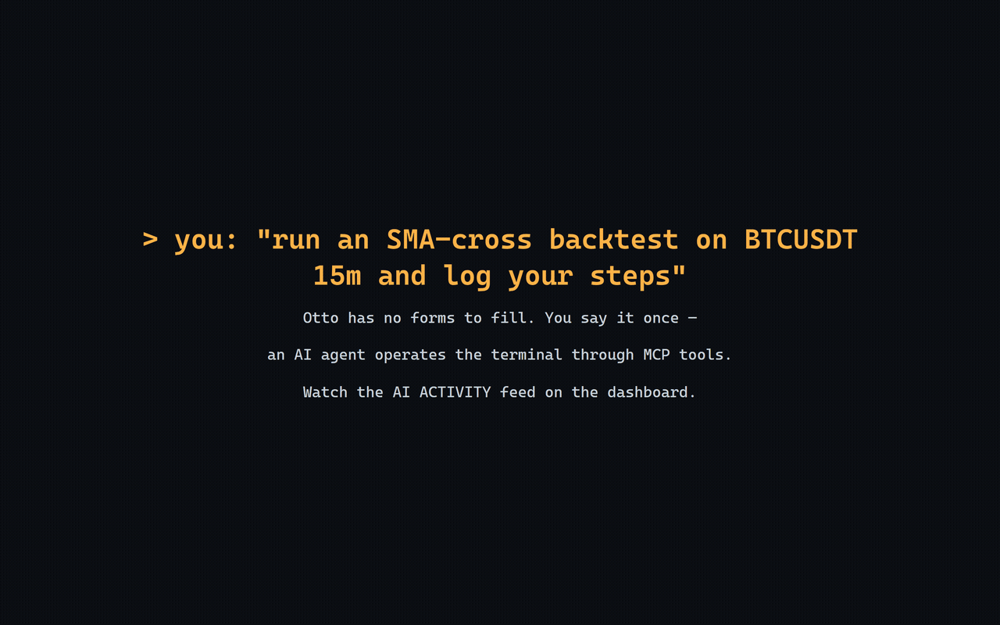

# Otto

[](https://github.com/0Smallcat0/otto/actions/workflows/ci.yml)

A local financial terminal your AI agent operates for you. Market data, backtests, paper
books, news — driven in plain language, running entirely on your machine.



## Try it

Needs [uv](https://docs.astral.sh/uv/) and Python 3.12. No clone, no build, no server to start:

```bash
claude mcp add otto -- uvx --from git+https://github.com/0Smallcat0/otto otto-terminal
```

Then ask for things:

- *"Refresh market data and show me the BTC snapshot."*
- *"Backtest an SMA cross on BTCUSDT and tell me if it's any good."*
- *"What do you make of my holdings?"*

**The dashboard comes with it.** The built UI ships inside the package, so there is nothing
to compile: the MCP server starts the backend the first time your agent touches the
terminal, and <http://127.0.0.1:8765/> is the screen. Working from a clone instead? Build it
once with `npm --prefix frontend install && npm --prefix frontend run build`, then
`uv run otto`.

## Why this one

**It keeps score, and the score is published even when it is bad.** The agent records dated
calls — a stance, the reasoning, the price level that would prove it wrong, a horizon — and
every call is later graded against the price the market actually printed. Calls without
reasoning are refused rather than guessed, moves inside a flat band don't count as skill,
and a call graded long after it matured is excluded because it measured a window its thesis
never claimed.

Here is the entire record so far. It is a small, unflattering sample, and that is the point
of showing it:

| | |
|---|---|
| Calls journaled | 13 (5 still open, 4 withdrawn and never scored) |
| Hit rate | **0%** — 0 of 4 graded theses held |
| Beat its index | **2 of 3** measurable calls, average excess **−0.22%** |

Those two lines disagree on purpose, and the disagreement is the reason the second one
exists. A hold graded a 6.6% loss over a window its index fell 7.9% did worse than nothing
and better than the alternative; a hit rate can only see the first half. Excess return is
measured against `0050.TW`, `SPY` or `BTC-USD` over the call's own window, and a call that
meant to *stay out* beats the index when the thing it avoided lagged — so a negative excess
is a win for that stance, and the board colours by verdict rather than by sign.

These are one operator's calls on one operator's holdings, so the ledger behind them stays
on that machine and is not in this repo — what ships is the machinery that produces and
grades them, and `GET /api/research/ledger` reports the same block for yours. All three
graded comparisons rest on an index level reconstructed from that session's published close
rather than stamped live when the call was struck; the ledger marks those, the scorecard
counts them, and the board flags them, because a weaker measurement that looks identical to
a strong one is just a lie with extra steps.

**"An AI can operate it" is a benchmark here, not a tagline.** A real headless agent gets
plain-language tasks in hermetic sandboxes, graded programmatically on terminal state and
artifacts — never by an LLM judge:

| Model | Passed | Avg turns | Run |
|---|---|---|---|
| `claude-sonnet-5` | 20 / 20 | 6.5 | 2026-07-10, 20-task suite |
| `claude-haiku-4-5` | 19 / 20 | 6.8 | 2026-07-10, 20-task suite |

The suite has since grown to 21 tasks and the MCP surface has changed, so those figures are
dated rather than current — reproduce them yourself with `python evals/run_eval.py --model
claude-sonnet-5`. A run whose agent never starts reports *no score* rather than zero, and
refuses to write the report at all, because a benchmark that did not execute is not a result.

Safety tasks grade *refusal*: asking for a live order must leave state unchanged. Live
trading, credential entry and code execution aren't switched off — they're unreachable
through the surface the agent has.

## Under the hood

One typed contract (142 actions across 16 routes) is the single source of truth; the MCP
tools, the UI capability catalog and the eval suite are all derived from it. 779 tests on
Windows + Linux CI.

- [Architecture](docs/architecture/ARCHITECTURE.md) · [ADRs](docs/architecture/)
- [AI operator guide](docs/AI_OPERATOR_GUIDE.md)
- [Eval methodology and full results](evals/EVAL.md)
- [Clean-room boundary](AGENTS.md) — built by observing a reference terminal's workflow,
  never by reading or porting its code; a [test](tests/test_clean_room_source_wall.py) fails
  the build if that wall is crossed.

```bash
python -m pytest -q && python -m ruff check .
```

## License

[MIT](LICENSE).
