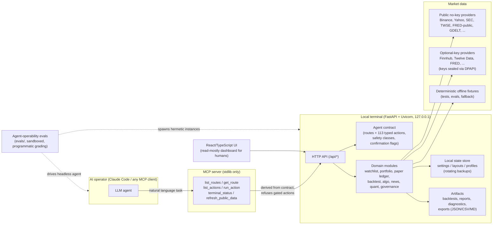

# Otto Architecture

Otto is an **agent-native** local financial terminal: the primary user interface
is a conversation with an AI operator, and the GUI is a dashboard humans read
while the agent works. This document describes how that inversion shapes the
system. Decision records live beside it (ADR-0001..0004).

## System overview

## The agent-first inversion

A conventional app treats automation as an afterthought bolted onto a human UI.
Otto reverses the dependency order:

1. **Contract first.** Every capability is declared in
   `src/local_terminal/agent_contract.py`: endpoint, request/response shape,
   mutation flags, artifact roots, safety class, confirmation requirement,
   expected error codes. The contract is served at `/api/agent-contract`.
2. **Derived surfaces.** The MCP tool set, the UI capability catalog, and the
   Command Center preflight matrix are all generated from that one contract, so
   they cannot drift apart. (ADR-0002)
3. **Structural safety.** Live order paths do not exist; secrets never transit
   agent tools; destructive actions require typed confirmation flags; protected
   state keeps rotating backups. Gates are construction, not prompts. (ADR-0003)
4. **Measured operability.** `evals/` benchmarks real agents against the
   contract in hermetic sandboxes with programmatic grading, so "AI-operated"
   is a number, not a slogan. (ADR-0004)

## Backend layout

- `src/local_terminal/server.py` — FastAPI app; every route handler validates
  against the contract types. `LOCAL_TERMINAL_HOST/PORT` env overrides support
  parallel sandboxed instances.
- `src/local_terminal/storage.py` — repo-local persistence with
  `LOCAL_TERMINAL_STATE_ROOT` isolation (used by tests and evals) and rotating
  `.bak` slots for protected files.
- Domain modules are flat, dependency-light files (watchlist, portfolio,
  crypto paper ledger, backtest, algo, news + digest, quant_lab, quantlib,
  governance, ...). Data providers live beside them (`*_data.py`), each with a
  deterministic offline fallback.
- `src/local_terminal/mcp_server.py` — zero-dependency stdio MCP server;
  injectable transport (urllib at runtime, in-process TestClient in tests).

## Research pipeline (quant)

The backtest engine is deliberately conservative:

- closed candles only, signals on close fill on next open (lookahead guard),
- Decimal money math, explicit fee + slippage economics,
- fixed-parameter walk-forward validation with consistency verdicts,
- bounded grid-search optimization with an overfitting-aware headline
  (full-window result stays the reference),
- every run writes a self-describing artifact directory (config, data
  snapshot, trades, signals, returns analysis, provenance, manifest, report).

## Verification

- 450+ pytest tests (contract truths, storage, domain rules, MCP server) and
  ruff, on CI.
- Playwright e2e for the UI shell.
- Agent-operability suite (`evals/`) for the operator path.

## Clean-room boundary

Otto is a clean-room rebuild from observed behavior of a commercial terminal:
no branding, no commercial mechanics, no ported implementation source. The
boundary and its enforcement live in `AGENTS.md` and
`tests/test_clean_room_source_wall.py`.
